# MAD_Chittr-Project
Chittr is a Microblogging platform that enable users to sign up for an account and publish 'Chits' (Short texual based) posts that are no longer than 141 characters.
After creating an account, the user can add a profile picture for their account which can be updated anytime using the photo's on the device or taking a photo using the phones camera. User's can follow their friends and collegues to be updated on their activities and know what they are 'Chitting' about. A new feature was added that allows pictures to be published as chits, instead of just Text, you can share your experiences with your followers.
This platform also allows users to get a taste of the experience before creating an account. Without an account, the user can view all the chits posted, search through and view the profiles of all the users on the platform.

## Visuals
There are screenshots of the application below, that show how it looks, including how the application works.

        Login Screen
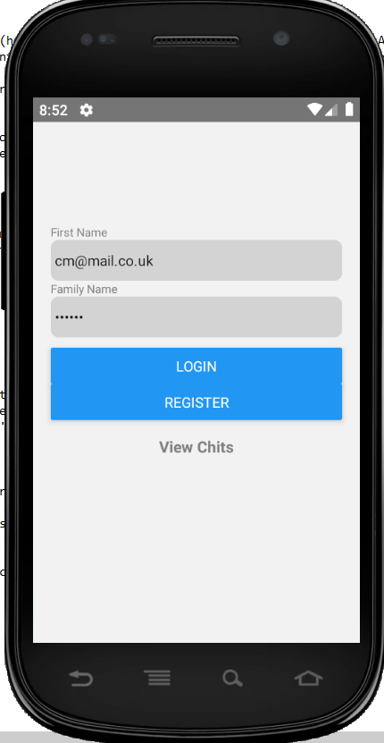

        User Profile Screen
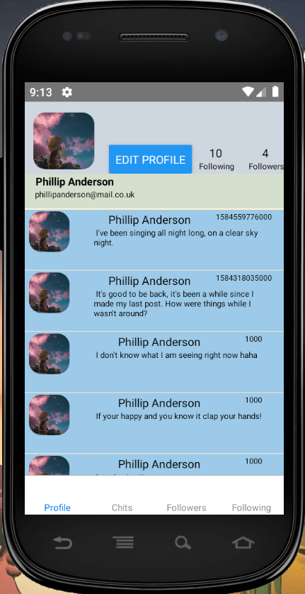

        Edit Profile Screen
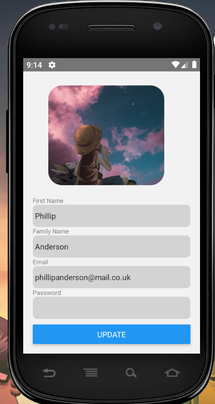

      Followers Screen
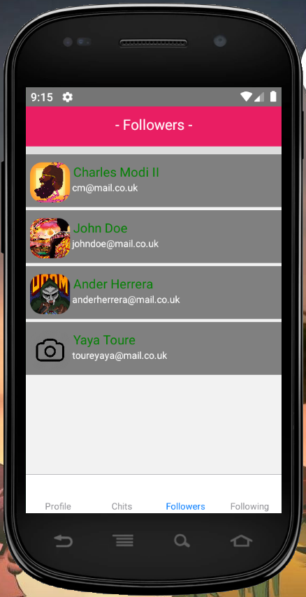

      Following Screen
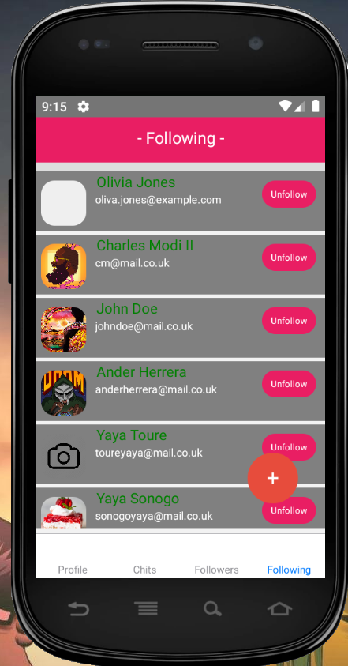

      Post Chits Screen
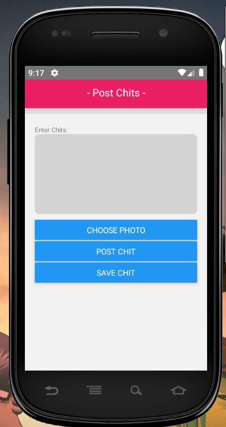

      View Saved Chit Drafts Screen
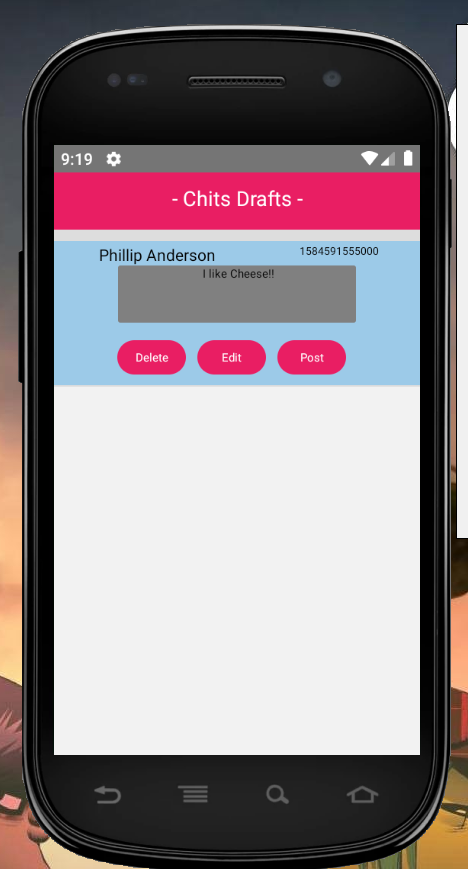


## Installation
Before showing how to run the application, you will need to install the React Native platform on your machine. Click [Here](https://reactnative.dev/docs/getting-started) to redirect you to the instructions of how to install React Native CLI on your machine. On the link provided above, follow the instructions for the React Native CLI Quickstart.
Before running the chitr app on your device, navigate using the command prompt to the 'myApp' folder and use the package manager [npm](https://www.npmjs.com/) to install packages below that are used by the application:
```bash
npm install react-native-geolocation-service
npm install react-native-image-picker

npm i react-navigation-stack
npm i react-navigation-tabs
npm i react-navigation
npm i react-native-vector-icons
npm i react-native-action-button 

```
## Steps to Run the Application
I will now guide you through how to run the application below.

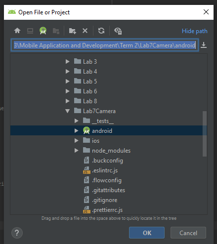


After installing the packages above, to run the application first run Android Studio, open the 'android' folder inside the 'myApp' folder and run the program on an emulator.


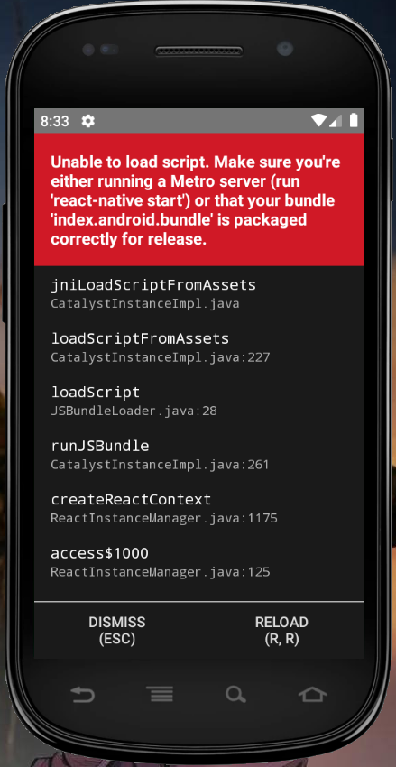
The App has finished loading on the emulator.


Start the Server

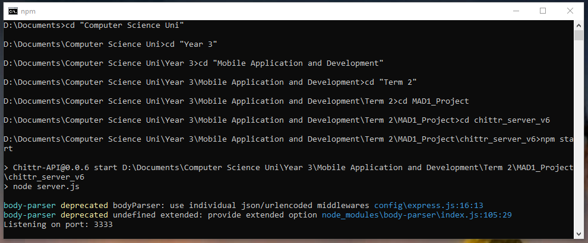

Once then emulator has finished loading, open the command prompt and navigate to the 'chittr_server_v6' folder and type npm start on the cmd.


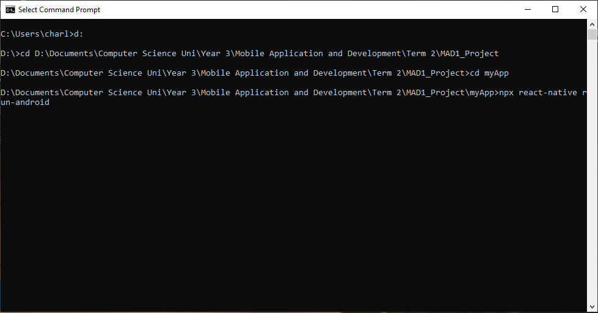
After the server is on, open another Command Prompt, navigate to the 'myApp' project directory and type npx react-native run-android. This will start the application and the Login Page will be displayed on the screen.


