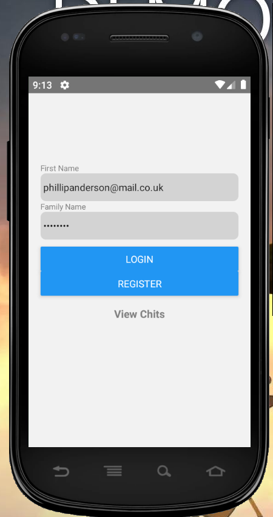

# MAD_Chittr-Project
Chittr is a Microblogging platform that enable users to sign up for an account and publish 'Chits' (Short texual based) posts that are no longer than 141 characters.
After creating an account, the user can post a profile picture which can be updated anytime using the photo's on the device or taking a photo using the phones camera. User's can follow their friends and collegues to be updated on their activities and know what they are 'Chitting' about. A new feature was added that allows pictures to be published.
This platform also allows users to get a taste of the experience before creating an account. Without an account, the user can view all the chits posted, search through and view the profiles of all the users on the platform.

## Visuals
There are screenshots of the application below, that show how it looks, including how the application works.

## Installation

Use the package manager [npm](https://www.npmjs.com/) to install packages for the App to work.
Guide to setting up Environment before installing the Packages: https://reactnative.dev/docs/getting-started

Navigate to the project folder and install the following Packages:

```bash
npm install react-native-geolocation-service
npm install react-native-image-picker

npm i react-navigation-stack
npm i react-navigation-tabs
npm i react-navigation
npm i react-native-vector-icons
npm i react-native-action-button 

```

## Usage

```python
import foobar

foobar.pluralize('word') # returns 'words'
foobar.pluralize('goose') # returns 'geese'
foobar.singularize('phenomena') # returns 'phenomenon'
```

## Contributing
Pull requests are welcome. For major changes, please open an issue first to discuss what you would like to change.

Please make sure to update tests as appropriate.

## License
[MIT](https://choosealicense.com/licenses/mit/)
